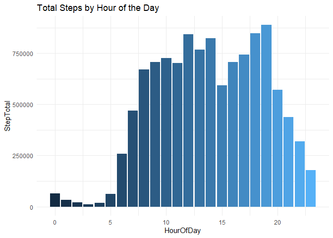
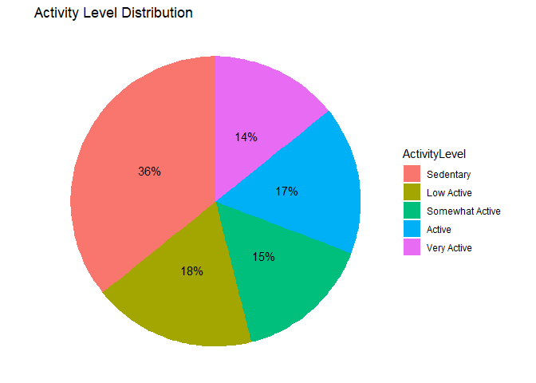
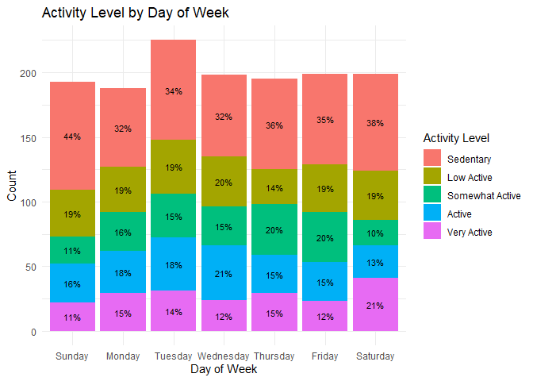
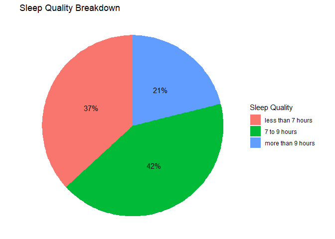
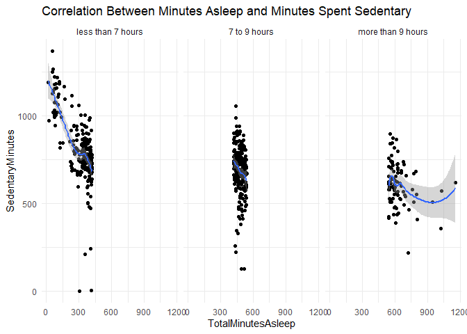
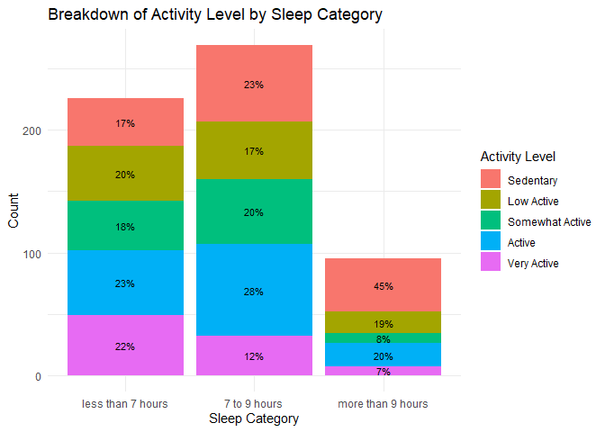

Bellabeat Case Study Using R.R
================
Eric Wheeler
2024-03-11

## Background:

[Bellabeat](https://bellabeat.com/) is a high-tech manufacturer of
health-focused products for women. Their Bellabeat app provides users
with health data related to their activity, sleep, stress, menstrual
cycle, and mindfulness habits. The Chief Creative Officer of Bellabeat
believes that analyzing smart device fitness data could help unlock new
growth opportunities for the company.

## Goal:

Analyze smart device data to gain insight into how consumers are using
their smart devices. The insights will then be used to help guide
marketing strategy for the company.

## Guiding Questions:

1.  What are some trends in smart device usage?

2.  How could these trends apply to Bellabeat customers?

3.  How could these trends help influence Bellabeat marketing strategy?

## 1. Data Sourcing

[FitBit Fitness Tracker
Data](https://www.kaggle.com/datasets/arashnic/fitbit/data) (CC0: Public
Domain, dataset made available through Mobius): This Kaggle data set
contains personal fitness tracker from thirty Fitbit users. Thirty
eligible Fitbit users consented to the submission of personal tracker
data, including minute-level output for physical activity, heart rate,
and sleep monitoring. It includes information about daily activity,
steps, and heart rate that can be used to explore users’ habits.

I have identified a number of limitations to be aware of for this
dataset:

- Small sample size - there are only 30 participants in this dataset

- Short time frame - the data only covers a period of two months which
  could lead to possible seasonal influences on the level of activity
  performed by participants.

- Inconsistent data - there are gaps in the data such as not all
  participants using the fitness trackers while they sleep, and weight
  data is a mixture of self-reported and auto-logged measurements.

The Bellabeat dataset contains 2 folders that have a total of 29 CSV
files.

- One folder consists of 11 CSV files for the 3.12.16 - 4.11.16 date
  range.

- The other folder consists of 18 CSV files for the 4.12.16 - 5.12.16
  date range.

The file names in the two folders are identical, which could lead to
confusion when trying to work with them. After selecting the files that
would be useful for this analysis, I updated the file names to include
the date range for the data.

I chose the files that contained:

- Daily Activity

- Hourly Steps

- Minute Sleep

- Sleep Day

Each of these areas had corresponding files in each folder, with the
exception of sleep data. I will use data manipulation to convert the
Minute Sleep data to Sleep Day data.

### 1.1 Data Importation

Load the necessary packages and import the CSV files.

``` r
library(tidyverse) # this collection contains packages used in the analysis i.e. dplyr, ggplot2, tidyr, lubridate
```

    ## ── Attaching core tidyverse packages ──────────────────────── tidyverse 2.0.0 ──
    ## ✔ dplyr     1.1.4     ✔ readr     2.1.5
    ## ✔ forcats   1.0.0     ✔ stringr   1.5.1
    ## ✔ ggplot2   3.5.0     ✔ tibble    3.2.1
    ## ✔ lubridate 1.9.3     ✔ tidyr     1.3.1
    ## ✔ purrr     1.0.2     
    ## ── Conflicts ────────────────────────────────────────── tidyverse_conflicts() ──
    ## ✖ dplyr::filter() masks stats::filter()
    ## ✖ dplyr::lag()    masks stats::lag()
    ## ℹ Use the conflicted package (<http://conflicted.r-lib.org/>) to force all conflicts to become errors

``` r
daily_activity_1  <- read.csv("C:/Users/Eric/OneDrive/Desktop/Bellabeat Folder/3.12.16-4.11.16_dailyActivity_merged.csv")
hourly_steps_1  <- read.csv("C:/Users/Eric/OneDrive/Desktop/Bellabeat Folder/3.12.16-4.11.16_hourlySteps_merged.csv")
minute_sleep_1  <- read.csv("C:/Users/Eric/OneDrive/Desktop/Bellabeat Folder/3.12.16-4.11.16_minuteSleep_merged.csv")
daily_activity_2  <- read.csv("C:/Users/Eric/OneDrive/Desktop/Bellabeat Folder/4.12.16-5.12.16_dailyActivity_merged.csv")
hourly_steps_2  <- read.csv("C:/Users/Eric/OneDrive/Desktop/Bellabeat Folder/4.12.16-5.12.16_hourlySteps_merged.csv")
day_sleep_2  <- read.csv("C:/Users/Eric/OneDrive/Desktop/Bellabeat Folder/4.12.16-5.12.16_sleepDay_merged.csv")
```

### 1.2 Validate Participants

Let’s validate the number of participants in each dataframe.

``` r
n_distinct(daily_activity_1$Id)
```

    ## [1] 35

``` r
n_distinct(daily_activity_2$Id)
```

    ## [1] 33

``` r
n_distinct(minute_sleep_1$Id)
```

    ## [1] 23

``` r
n_distinct(day_sleep_2$Id) 
```

    ## [1] 24

``` r
n_distinct(hourly_steps_1$Id)
```

    ## [1] 34

``` r
n_distinct(hourly_steps_2$Id)
```

    ## [1] 33

There is fluctuating participation for each dataset as well as more
participants than stated in the brief. Also, it appears that there were
much fewer participants using their smart devices to track their sleep.

## 2. Data Cleaning

### 2.1 Align the Sleep Data

I’ve already identified that one dataset on sleep contains minute
measurements while another contains daily measurements for sleep
minutes. First I’ll look at both sleep files to see how I can approach
aligning the data. Then I’ll make the necessary adjustments to both data
frames to prepare them to be combined later on.

``` r
glimpse(minute_sleep_1)
```

    ## Rows: 198,559
    ## Columns: 4
    ## $ Id    <dbl> 1503960366, 1503960366, 1503960366, 1503960366, 1503960366, 1503…
    ## $ date  <chr> "3/13/2016 02:39:30", "3/13/2016 02:40:30", "3/13/2016 02:41:30"…
    ## $ value <int> 1, 1, 1, 1, 1, 1, 2, 2, 1, 1, 2, 2, 1, 1, 1, 1, 1, 1, 1, 1, 1, 1…
    ## $ logId <dbl> 11114919637, 11114919637, 11114919637, 11114919637, 11114919637,…

``` r
glimpse(day_sleep_2)
```

    ## Rows: 413
    ## Columns: 5
    ## $ Id                 <dbl> 1503960366, 1503960366, 1503960366, 1503960366, 150…
    ## $ SleepDay           <chr> "4/12/2016", "4/13/2016", "4/15/2016", "4/16/2016",…
    ## $ TotalSleepRecords  <int> 1, 2, 1, 2, 1, 1, 1, 1, 1, 1, 1, 1, 1, 1, 1, 1, 1, …
    ## $ TotalMinutesAsleep <int> 327, 384, 412, 340, 700, 304, 360, 325, 361, 430, 2…
    ## $ TotalTimeInBed     <int> 346, 407, 442, 367, 712, 320, 377, 364, 384, 449, 3…

``` r
# Make adjustments to minute_sleep_1
minute_sleep_1 <- minute_sleep_1[-4] %>% # Remove the logId column
  mutate(date = as.Date(date, format = "%m/%d/%Y %H:%M:%S")) %>% # Change the date data type to timestamp
  rename(Date = date) # Rename the date column to align with day_sleep_2

# Create a new aggregated day_sleep_1 dataframe 
day_sleep_1 <- minute_sleep_1 %>%
  group_by(Id, Date) %>% # group the data by the Id and Date columns
  summarise(TotalMinutesAsleep = sum(value)) # Get the sum of the minute sleep values
```

    ## `summarise()` has grouped output by 'Id'. You can override using the `.groups`
    ## argument.

``` r
# Adjust day_sleep_2 to match newly created day_sleep_1
day_sleep_2 <- day_sleep_2[-c(3,5)] %>% # Drop unneccessary columns
  mutate(SleepDay = as.Date(SleepDay, format = "%m/%d/%Y")) %>% # Change the SleepDay data type to timestamp
  rename(Date = SleepDay) # rename the SleepDay column
```

### 2.2 Check for Null Values

``` r
colSums(is.na(daily_activity_1)) 
```

    ##                       Id             ActivityDate               TotalSteps 
    ##                        0                        0                        0 
    ##            TotalDistance          TrackerDistance LoggedActivitiesDistance 
    ##                        0                        0                        0 
    ##       VeryActiveDistance ModeratelyActiveDistance      LightActiveDistance 
    ##                        0                        0                        0 
    ##  SedentaryActiveDistance        VeryActiveMinutes      FairlyActiveMinutes 
    ##                        0                        0                        0 
    ##     LightlyActiveMinutes         SedentaryMinutes                 Calories 
    ##                        0                        0                        0

``` r
colSums(is.na(daily_activity_2)) 
```

    ##                       Id             ActivityDate               TotalSteps 
    ##                        0                        0                        0 
    ##            TotalDistance          TrackerDistance LoggedActivitiesDistance 
    ##                        0                        0                        0 
    ##       VeryActiveDistance ModeratelyActiveDistance      LightActiveDistance 
    ##                        0                        0                        0 
    ##  SedentaryActiveDistance        VeryActiveMinutes      FairlyActiveMinutes 
    ##                        0                        0                        0 
    ##     LightlyActiveMinutes         SedentaryMinutes                 Calories 
    ##                        0                        0                        0

``` r
colSums(is.na(day_sleep_1))
```

    ##                 Id               Date TotalMinutesAsleep 
    ##                  0                  0                  0

``` r
colSums(is.na(day_sleep_2))
```

    ##                 Id               Date TotalMinutesAsleep 
    ##                  0                  0                  0

``` r
colSums(is.na(hourly_steps_1)) 
```

    ##           Id ActivityHour    StepTotal 
    ##            0            0            0

``` r
colSums(is.na(hourly_steps_2)) 
```

    ##           Id ActivityHour    StepTotal 
    ##            0            0            0

There are no null values in any of the data frames.

### 2.3 Union the tables

We can union the tables to combine the 3/12/16-4/11/16 data with the
4/12/16-5/12/16 data. Once this is done we continue cleaning by
adjusting data types and removing duplicates

``` r
# Combine the sleep data 
day_sleep_df <- rbind(day_sleep_1, day_sleep_2)

# combine the daily activity data
daily_activity_df <- rbind(daily_activity_1, daily_activity_2)

# drop distance related columns in the daily acivity data
daily_activity_df <- daily_activity_df[-c(4:10)] 

# make adjustments to the daily activity data
daily_activity_df <- daily_activity_df %>%
  mutate(ActivityDate = as.Date(ActivityDate, format = "%m/%d/%Y")) %>% # Change ActivityDate data type to Date
  rename(Date = ActivityDate) # rename the ActivityDate column

# combine the hourly steps data
hourly_steps_df <- rbind(hourly_steps_1,hourly_steps_2)

# make adjustments to the steps data
hourly_steps_df$ActivityHour <- strptime(hourly_steps_df$ActivityHour, format="%m/%d/%Y %H:%M:%S") # change the ActivityHour data type to timestamp
```

### 2.4 Remove Duplicates

Now remove any duplicate rows that might exist in the data.

``` r
daily_activity_df <- daily_activity_df %>% distinct()
day_sleep_df <- day_sleep_df %>% distinct()
hourly_steps_df <- hourly_steps_df %>% distinct()
```

## 3. Feature Engineering

In order to uncover some insights from the data it will be helpful to
create some features from the existing dimensions. In terms of date/time
columns, we can extract the hour of the day, day of the week, and week
of the year from the data.

### 3.1 Extract Date/Time Features

``` r
# get the WeekOfYear and DayOfWeek for the daily activity data  
daily_activity_df$WeekOfYear <- as.integer(week(daily_activity_df$Date)) # create a WeekOfYear column

daily_activity_df$DayOfWeek <- wday(daily_activity_df$Date, label=TRUE, abbr=FALSE) # create a DayOfWeek column

# get the DayOfWeek for the sleep data
day_sleep_df$DayOfWeek <- wday(day_sleep_df$Date, label=TRUE, abbr=FALSE)

# get the HourOfDay for hourly steps data
hourly_steps_df$HourOfDay <- hour(hourly_steps_df$ActivityHour)
```

### 3.2 Create Sleep Categories

It would also be helpful to create some benchmarks that are fairly
universal regardless of age, sex, or race. We can create bins for steps
per day and sleep per day.

[The National Health Institute recommends that adults sleep between 7
and 9 hours a night and that adults who sleep less than 7 hours a night
may have more health
issues.](https://www.nhlbi.nih.gov/health/sleep/how-much-sleep#:~:text=Experts%20recommend%20that%20adults%20sleep,or%20more%20hours%20a%20night.)

We can create sleep categories that group users based on this
information.

``` r
# Define conditions and create SleepCategory column
day_sleep_df <- day_sleep_df %>%
  mutate(SleepCategory = case_when(
    TotalMinutesAsleep >= 420 & TotalMinutesAsleep <= 540 ~ "7 to 9 hours",
    TotalMinutesAsleep < 420 ~ "less than 7 hours",
    TotalMinutesAsleep > 540 ~ "more than 9 hours",
    TRUE ~ NA_character_  # for any other cases
  ))

# adjust the categories into a specified order
sleep_categories <- c("less than 7 hours", "7 to 9 hours", "more than 9 hours")

# set the categorical variables
day_sleep_df$SleepCategory <- factor(day_sleep_df$SleepCategory, levels = sleep_categories)
```

### 3.3 Create Activity Level Benchmarks

[The National Institute of Health has also set the following benchmarks
for activity based on daily step
counts:](https://pubmed.ncbi.nlm.nih.gov/14715035/)

- Sedentary is equal to \<5000 steps/day

- Low Active is equal to 5000-7499 steps/day

- Somewhat Active is equal to 7500-9999 steps/day

- Active is equal to \>=10000 steps/day

- Very Active is equal to \>12500 steps/day

We can create these categories as well.

``` r
# Define conditions and create ActivityLevel column
daily_activity_df <- daily_activity_df %>%
  mutate(ActivityLevel = case_when(
    is.na(TotalSteps) ~ "Unknown",
    TotalSteps < 5000 ~ "Sedentary",
    TotalSteps < 7500 ~ "Low Active",
    TotalSteps < 10000 ~ "Somewhat Active",
    TotalSteps < 12500 ~ "Active",
    TRUE ~ "Very Active"
  ))

# adjust the categories into a specified order
activity_levels <- c("Sedentary", "Low Active", "Somewhat Active", "Active", "Very Active")

# set the categorical variables
daily_activity_df$ActivityLevel <- factor(daily_activity_df$ActivityLevel, levels = activity_levels)
```

## 4. Exploratory Data Analysis

Get the summary statistics for our dataframes to understand the data
better.

``` r
summary(daily_activity_df)
```

    ##        Id                 Date              TotalSteps    VeryActiveMinutes
    ##  Min.   :1.504e+09   Min.   :2016-03-12   Min.   :    0   Min.   :  0.00   
    ##  1st Qu.:2.320e+09   1st Qu.:2016-04-09   1st Qu.: 3146   1st Qu.:  0.00   
    ##  Median :4.445e+09   Median :2016-04-19   Median : 6999   Median :  2.00   
    ##  Mean   :4.781e+09   Mean   :2016-04-19   Mean   : 7281   Mean   : 19.68   
    ##  3rd Qu.:6.962e+09   3rd Qu.:2016-04-30   3rd Qu.:10544   3rd Qu.: 30.00   
    ##  Max.   :8.878e+09   Max.   :2016-05-12   Max.   :36019   Max.   :210.00   
    ##                                                                            
    ##  FairlyActiveMinutes LightlyActiveMinutes SedentaryMinutes    Calories   
    ##  Min.   :  0.0       Min.   :  0.0        Min.   :   0.0   Min.   :   0  
    ##  1st Qu.:  0.0       1st Qu.:111.0        1st Qu.: 729.0   1st Qu.:1799  
    ##  Median :  6.0       Median :195.0        Median :1057.0   Median :2114  
    ##  Mean   : 13.4       Mean   :185.4        Mean   : 992.5   Mean   :2266  
    ##  3rd Qu.: 18.0       3rd Qu.:262.0        3rd Qu.:1244.0   3rd Qu.:2770  
    ##  Max.   :660.0       Max.   :720.0        Max.   :1440.0   Max.   :4900  
    ##                                                                          
    ##    WeekOfYear        DayOfWeek           ActivityLevel
    ##  Min.   :11.00   Sunday   :193   Sedentary      :500  
    ##  1st Qu.:15.00   Monday   :188   Low Active     :254  
    ##  Median :16.00   Tuesday  :225   Somewhat Active:213  
    ##  Mean   :16.15   Wednesday:198   Active         :231  
    ##  3rd Qu.:18.00   Thursday :195   Very Active    :199  
    ##  Max.   :19.00   Friday   :199                        
    ##                  Saturday :199

``` r
summary(day_sleep_df)
```

    ##        Id                 Date            TotalMinutesAsleep     DayOfWeek  
    ##  Min.   :1.504e+09   Min.   :2016-03-11   Min.   :   6.0     Sunday   :129  
    ##  1st Qu.:3.977e+09   1st Qu.:2016-03-27   1st Qu.: 379.0     Monday   :119  
    ##  Median :4.703e+09   Median :2016-04-10   Median : 454.0     Tuesday  :131  
    ##  Mean   :4.910e+09   Mean   :2016-04-10   Mean   : 441.8     Wednesday:125  
    ##  3rd Qu.:6.776e+09   3rd Qu.:2016-04-26   3rd Qu.: 526.0     Thursday :123  
    ##  Max.   :8.792e+09   Max.   :2016-05-12   Max.   :1201.0     Friday   :121  
    ##                                                              Saturday :129  
    ##            SleepCategory
    ##  less than 7 hours:323  
    ##  7 to 9 hours     :369  
    ##  more than 9 hours:185  
    ##                         
    ##                         
    ##                         
    ## 

``` r
summary(hourly_steps_df)
```

    ##        Id             ActivityHour                      StepTotal      
    ##  Min.   :1.504e+09   Min.   :2016-03-12 00:00:00.00   Min.   :    0.0  
    ##  1st Qu.:2.320e+09   1st Qu.:2016-03-26 13:00:00.00   1st Qu.:    0.0  
    ##  Median :4.559e+09   Median :2016-04-10 11:00:00.00   Median :   21.0  
    ##  Mean   :4.870e+09   Mean   :2016-04-10 17:33:39.75   Mean   :  302.9  
    ##  3rd Qu.:6.962e+09   3rd Qu.:2016-04-25 16:00:00.00   3rd Qu.:  323.0  
    ##  Max.   :8.878e+09   Max.   :2016-05-12 15:00:00.00   Max.   :10565.0  
    ##                      NA's   :33                                        
    ##    HourOfDay    
    ##  Min.   : 0.00  
    ##  1st Qu.: 5.00  
    ##  Median :11.00  
    ##  Mean   :11.45  
    ##  3rd Qu.:17.00  
    ##  Max.   :23.00  
    ## 

Summary Statistics Insights:

- The mean and median daily steps for these participants would be
  considered “low active”

- The average daily sedentary time for participants is over 16 hours a
  day. That’s a lot of sedentary time!

- The average sleep per night is between 7 and 8 hours.

- The median steps taken per hour is a mere 21 steps!

### 4.1 Total Steps by Hour of the Day

I’ll start by looking at the hourly breakdown of steps for these
participants

``` r
ggplot(data=hourly_steps_df, mapping = aes(x=HourOfDay, y=StepTotal, fill=HourOfDay)) +
  geom_bar(stat="sum") + 
  theme_minimal() + 
  theme(legend.position = "none") +
  labs(title = "Total Steps by Hour of the Day")
```

<!-- -->

Hourly Steps Insights:

- It looks like the most steps among these participants were taken from
  6-7 PM. Participants were the most active possibly just before or just
  after dinner time.

- During a typical 9-5 workday, the most steps were taken at 12 and 2.
  Generally speaking, it appears that these participants tended to do
  the most walking right around mealtimes.

### 4.2 Breakdown of Activity Levels

``` r
# calculate the percentage of each ActivityLevel 
activity_percentage <- daily_activity_df %>%   
  count(ActivityLevel) %>%   
  mutate(percentage = n / sum(n) * 100)  

# Create the pie chart 
ggplot(activity_percentage, aes(x = "", y = n, fill = ActivityLevel)) + 
  geom_bar(stat = "identity") +   
  coord_polar("y", start = 0) +   
  geom_text(aes(label = paste0(round(percentage), "%")), position = position_stack(vjust = 0.5)) +   
  labs(title = "Activity Level Distribution") +   
  theme_void()
```

<!-- -->

Activity Level Insights:

- 36% of days in this data were considered sedentary.
- Only 31% days hit the recommended 10K daily steps.

### 4.3 Activity Level by Day of the Week

``` r
# calculate the percentage of each ActivityLevel by DayOfWeek
dow_activity <- daily_activity_df %>%
  group_by(DayOfWeek, ActivityLevel) %>%
  summarise(count = n()) %>%
  group_by(DayOfWeek) %>%
  mutate(percentage = count / sum(count) * 100)
```

    ## `summarise()` has grouped output by 'DayOfWeek'. You can override using the
    ## `.groups` argument.

``` r
# create a bar chart 
ggplot(dow_activity, aes(x=DayOfWeek, y=count, fill=ActivityLevel)) +
  geom_bar(stat = "identity") +
  geom_text(aes(label = paste0(round(percentage), "%")),
            position = position_stack(vjust = 0.5), size = 3) +
  labs(title="Activity Level by Day of Week", x = "Day of Week", y = "Count", fill = "Activity Level") +
  theme(axis.text.x = element_text(angle = 45, hjust = 1)) + 
  theme_minimal()
```

<!-- -->

Day of Week Activity Level Insights:

- Sunday is when participants were the most Sedentary and also the least
  likely to be considered Very Active.

<!-- -->

- While Saturday was the 2nd most Sedentary day, it is also the day
  where participants were the most likely to be Very Active.

### 4.4 Breakdown of Sleep Categories

``` r
# calculate percentage breakdown of Sleep Quality
sleep_percentage <- day_sleep_df %>%   group_by(SleepCategory) %>%   summarize(count = n()) %>%   mutate(percentage = count / sum(count) * 100)  

# Create pie chart 
ggplot(sleep_percentage, aes(x = "", y = percentage, fill = SleepCategory)) +   
  geom_bar(stat = "identity") +   
  coord_polar("y", start = 0) + 
  theme_void() +   theme(legend.position = "bottom") +   
  geom_text(aes(label = paste0(round(percentage), "%")), position = position_stack(vjust = 0.5)) +   
  labs(title = "Sleep Quality Breakdown", fill = "Sleep Quality") +
  theme_void()
```

<!-- -->

Sleep insights

- 37% of days users were getting less than 7 hours of sleep

- Less than 50% of users were getting the appropriate 7-9 hours of sleep

### 4.5 Sleep by Day of the Week

``` r
# calculate counts of SleepCategory for each DayOfWeek
sleep_counts <- day_sleep_df %>%
  group_by(DayOfWeek, SleepCategory) %>%
  summarise(count = n()) %>%
  group_by(DayOfWeek) %>%
  mutate(percentage = count / sum(count) * 100)
```

    ## `summarise()` has grouped output by 'DayOfWeek'. You can override using the
    ## `.groups` argument.

``` r
# create the bar chart 
ggplot(sleep_counts, aes(x = DayOfWeek, y = count, fill = SleepCategory)) +
  geom_bar(stat = "identity") +
  geom_text(aes(label = paste0(round(percentage), "%")),
            position = position_stack(vjust = 0.5), size = 3) +
  labs(title="Sleep Quality by Day of Week", x = "Day of Week", y = "Count", fill = "Sleep Category") +
  theme(axis.text.x = element_text(angle = 45, hjust = 1)) + 
  theme_minimal()
```

<!-- -->

Day of the Week Sleep Insights:

- Sundays and Saturdays were the days most often for users to get more
  than 9 hours of sleep. Considering that these were also the days with
  the highest likelihood of being considered sedentary, we should look
  to see if there’s a correlation between sleep and sedentary minutes
  and activity levels.

- During the week it’s likely that participants are getting the
  appropriate 7-9 hours of sleep less than 50% of the time. In fact, on
  days like Tuesday and Friday, around 50% of nights had less than 7
  hours of sleep.

### 4.6 Join the Activity and Sleep Dataframes to Explore Potential Correlations

Remove days with double log entries in the daily_activity_df before
joining

``` r
# find rows that contain the same Id and Date i.e. double entries
duplicate_rows <- daily_activity_df %>%
  filter(duplicated(daily_activity_df[, c("Id", "Date")]) | duplicated(daily_activity_df[, c("Id", "Date")], fromLast = TRUE))

# Remove double entries from daily_activity_df
daily_activity_df <- anti_join(daily_activity_df, duplicate_rows, by = c("Id", "Date"))
```

Join the Daily Activity and Day Sleep tables to see rows that have both
sleep and activity data

``` r
daily_df <- inner_join(day_sleep_df, daily_activity_df, by = c("Id", "Date", "DayOfWeek"))
```

### 4.7 Does the Amount of Sleep Correlate with Sedentary Minutes?

``` r
# create a scatter plot for TotalMinutesAsleep and SedentaryMinutes with facets around SleepCategory
ggplot(data=daily_df, mapping = aes(x=TotalMinutesAsleep, y=SedentaryMinutes)) +
  geom_point() +
  geom_smooth() +
  theme_minimal() +
  facet_wrap(~SleepCategory) +
  labs(title = "Correlation Between Minutes Asleep and Minutes Spent Sedentary")
```

    ## `geom_smooth()` using method = 'loess' and formula = 'y ~ x'

<!-- -->

Sleep and Sedentary Minutes Insights:

- For the instances when users slept less than 7 hours and between 7 to
  9 hours, it appears that sleeping longer is strongly correlated with a
  reduction in sedentary minutes the same day. When it comes to
  instances when participants slept more than 9 hours, it appears that
  additional sleep correlates with fewer sedentary minutes, but only
  until sleep reaches about 15 hours in which case additional sleep had
  the opposite effect.

### 4.8 Does Sleep Have a Correlation With Activity Level?

``` r
# calculate counts of instances for each combination of SleepCategory and ActivityLevel
count_data <- daily_df %>% 
  group_by(SleepCategory, ActivityLevel) %>%
  summarise(count = n()) %>%
  mutate(percentage = count / sum(count) * 100)
```

    ## `summarise()` has grouped output by 'SleepCategory'. You can override using the
    ## `.groups` argument.

``` r
# Create the bar chart
ggplot(count_data, aes(x = SleepCategory, y = count, fill = ActivityLevel)) +
  geom_bar(stat = "identity", position = "stack") +
  geom_text(aes(label = paste0(round(percentage), "%")), position = position_stack(vjust = 0.5), size = 3) +
              labs(title="Breakdown of Activity Level by Sleep Category", x = "Sleep Category", y = "Count", fill = "Activity Level") +
              theme(axis.text.x = element_text(angle = 45, hjust = 1)) +
  theme_minimal()
```

<!-- -->

Activity Level and Sleep Category Insights:

- Surprisingly, days where there participants had less than 7 hours of
  sleep actually produced the lowest instances of sedentary days and the
  highest level of very active days.

- Days where participants slept more than 9 hours were also the most
  likely to be labeled as sedentary

## 5. Takeaways:

- Only 31% of days hit the recommended daily step count of 10K steps,
  with the average daily step count putting these participants in the
  “low active” category. The most common Activity Level in this study
  was “sedentary,” with the average daily sedentary time coming in at
  over 16 hours a day. By using the Activity Level Benchmarks provided
  by the NIH, the smart devices can update users on what category they
  are currently in, and provide them with a countdown to how many steps
  will get them to the next Activity Level.

- The most steps taken each day fell around meal times. [A study
  published in the Springer Journal of Sports
  Medicine](https://link.springer.com/article/10.1007/s40279-022-01649-4)
  claims that walking after eating regulates blood sugar, improves blood
  circulation, and lowers blood pressure. By adding a feature on the
  smart device that monitors sedentary time between 12-2PM and 6-7PM,
  users can be reminded to get active after a meal to receive these
  benefits.

- Less than 50% of days consisted of the appropriate 7-9 hours of sleep
  and 37% of days had participants getting less than 7 hours of sleep.
  Getting more sleep was correlated with participants spending fewer
  minutes sedentary that day. If users are wearing their smart devices
  to track sleep, the device can give warnings if the user is
  approaching the “less than 7 hours” sleep category.

- Participants were also sleeping the most and walking the least on
  Sundays, while Saturday also had a higher likelihood to be considered
  “sedentary” compared with weekdays. The smart device could have
  special settings for weekends to remind users to get active if
  sedentary time hits a certain threshold.

